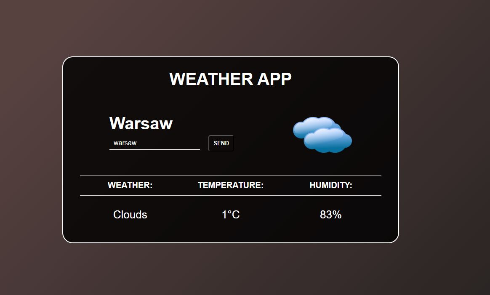

# Weather-app

# Project description

Weather app is simple app made to show basic infromations about current weather in any city or country on the earth.
This project was created for the purpose of learning to develop skills in connection with the api.

The application uses technologies such as:

* HTML
* CSS
* JAVASCRIPT
